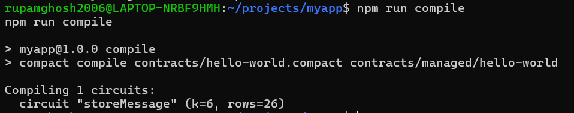
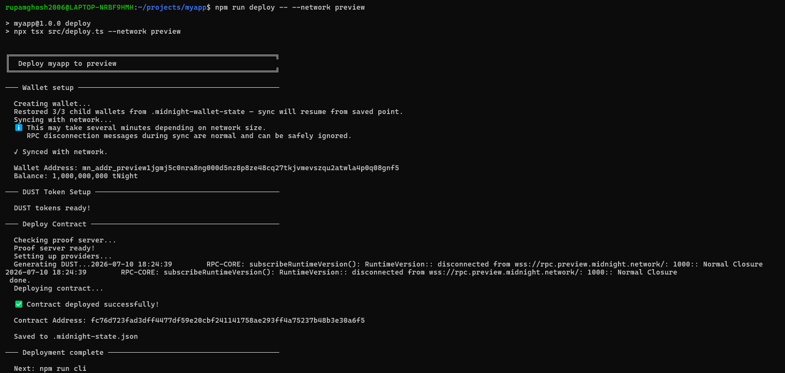
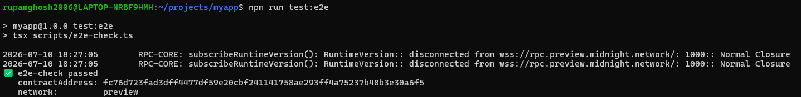

# Getting Started with Midnight

A decentralized message board built on Midnight Network — users can store and retrieve messages on-chain with the privacy guarantees of zero-knowledge proofs. This project demonstrates the core Midnight development workflow: writing a Compact smart contract, compiling circuits, deploying to multiple networks, and interacting via a CLI.

## Navigation

- [Product Idea](#product-idea)
- [Setup Instructions](#quick-start)
- [Compile Output (Screenshot)](#compile-output)
- [Contract Deployed on Preview (Screenshot)](#contract-deployed-on-preview)
- [E2E Test Passing (Screenshot)](#e2e-test-passing)
- [Public State vs Private Witness](#public-state-vs-private-witness)
- [Deployed Contracts](#deployed-contracts)
- [Available Scripts](#available-scripts)
- [Project Structure](#project-structure)

## Product Idea

### Lace frontend and private proof

The browser UI in `frontend/` exposes explicit 1AM and Lace connection controls. The 1AM connector uses `window.midnight['1am'].connect('preprod')`; current Lace uses `window.lace.midnight.enable()`. Both have an in-app Disconnect action and clear the private form value on disconnect. The current v4 deployment and proof-submission adapter is provided by 1AM, avoiding the headless full-history sync.

`provePrivateKnowledge(accessPhrase: Bytes<21>)` proves private knowledge without placing that phrase in public ledger state. The observable receipt is only `latestProofAccepted` and the `successfulProofs` counter. The phrase predicate is a demo; replace it with a credential or commitment predicate before production use.

```sh
npm run compile
npm run web:dev
npm run verify:preprod
```

For a distributable site, run `npm run web:build`; it compiles the contract and includes the required ZK key artifacts in the web bundle.

`verify:preprod` queries the public Preprod indexer and prints the address and Explorer URL. A funded Preprod wallet is required to deploy; this project deliberately does not invent an address.

A decentralized message board where anyone can store a public message on the Midnight blockchain. Each update generates a zero-knowledge proof that the transaction is valid, while the message itself remains visible to all — perfect for verifiable public announcements, attestations, or simple social applications that benefit from Midnight's unique balance of transparency and privacy.

## Quick start

Requirements: Node 22, Docker (with Compose v2), and the Compact compiler at the version pinned in `.compact-version` at the create-mn-app repo root (the version this project was scaffolded against).

```bash
npm install
npm run setup
npm run test:e2e
```

`npm run setup` runs end-to-end with no prompts:

1. `docker compose up -d --wait` — starts a local Midnight devnet (node, indexer, proof-server) and blocks until all three pass their healthchecks.
2. `npm run compile` — compiles `contracts/hello-world.compact` to `contracts/managed/hello-world/`.
3. `npm run deploy` — derives the genesis-seed wallet (NIGHT pre-minted), registers UTXOs for DUST generation, deploys the contract, writes `.midnight-state.json`.

`npm run test:e2e` reconnects to the deployed contract and reads its ledger state. Exits 0 if the contract is live and indexable.

## Local devnet

The project ships its own devnet via `docker-compose.yml`:

| Service        | Port | Purpose                                         |
| -------------- | ---- | ----------------------------------------------- |
| `node`         | 9944 | Midnight node, `dev` chain preset               |
| `indexer`      | 8088 | GraphQL indexer for chain state                 |
| `proof-server` | 6300 | Generates ZK proofs for contract transactions   |

State lives in container-managed volumes. Tear everything down with:

```bash
docker compose down -v
```

That removes all containers, networks, and volumes. The next `npm run setup` starts from a clean slate.

## ⚠️ LOCAL DEVNET ONLY

The deploy script uses a well-known genesis seed (`0000…0001`) so the
pre-minted NIGHT in the `dev` chain preset is immediately available. **Do
not use this seed against Preprod, mainnet, or any environment that
handles real value** — anyone running this devnet has full access to
funds at this seed.

## Networks

This DApp supports three networks:

| Network | When to use | Default? |
|---|---|---|
| `undeployed` | Local devnet bundled in `docker-compose.yml`. Genesis seed is hardcoded; no funding needed. | yes |
| `preview` | Public preview testnet. Faucet at `https://midnight-tmnight-preview.nethermind.dev`. |  |
| `preprod` | Public preprod testnet. Faucet at `https://midnight-tmnight-preprod.nethermind.dev`. |  |

The active network is **sticky**: whichever network you last interacted
with stays active until you switch. Any command run with `--network <name>`
also sets that network active for subsequent commands. The default on a
fresh project is `undeployed` (local devnet).

```sh
npm run setup -- --network preview   # runs on preview AND makes it active
npm run cli                          # still uses preview
npm run check-balance                # still uses preview
```

You can also switch without running anything else:

```sh
npm run network preview         # active network is now preview
npm run network                 # prints current active network
npm run network undeployed      # switch back to local devnet
```

### How wallets work across networks

- `undeployed` uses a hardcoded genesis seed. Local devnet pre-funds it.
- `preview` and `preprod` generate a fresh seed on first use and store it
  in `.midnight-state.json` (gitignored). The seed survives switching
  networks — switch back later and your funded wallet returns.
- **Back up your seed** if you fund a public-network wallet you care
  about. Open `.midnight-state.json` and copy the relevant
  `wallets.<network>.seed` value to a safe place.

### Funding a public-network wallet

On the first run with `--network preview` (or `preprod`):

1. `setup` will print your wallet address and the faucet URL.
2. Open the faucet URL, paste the address, request tNIGHT.
3. `setup` polls the wallet balance every 10 s and continues automatically
   once funds arrive.
4. The default poll budget is 10 minutes. Override with
   `MIDNIGHT_FAUCET_TIMEOUT_MS=1800000` (30 min) for unattended runs.

If the faucet is slow or the script times out, your seed is preserved.
Re-run `npm run setup -- --network preview` once the funds land.

### Environment overrides

These env vars override the active network's config (no per-network
suffix — they apply to whichever network is active for the run):

| Variable | Effect |
|---|---|
| `MIDNIGHT_WALLET_SEED` | Use this seed instead of generating/persisting one. Useful for CI with a pre-funded wallet. |
| `MIDNIGHT_INDEXER_URL` | Override the indexer GraphQL URL. |
| `MIDNIGHT_INDEXER_WS_URL` | Override the indexer WS URL. |
| `MIDNIGHT_NODE_URL` | Override the node RPC URL. |
| `MIDNIGHT_FAUCET_URL` | Override the faucet URL printed during setup. |
| `MIDNIGHT_PROOF_SERVER_URL` | Override the proof server URL — set to a public proof server (e.g. `https://lace-proof-pub.preview.midnight.network`) to skip running one locally. |
| `MIDNIGHT_FAUCET_TIMEOUT_MS` | Faucet poll budget in milliseconds (default 600000 = 10 min). |

By default all networks use the **local** proof server. Public proof
servers exist (see the env override above) but the local default keeps
your witness data on your machine and avoids depending on a remote
service for the deploy hot path.

### Switching back to local devnet

```sh
npm run network undeployed     # or: npm run setup -- --network undeployed
```

Your preview/preprod wallet seeds and deploy addresses stay in
`.midnight-state.json`. Switch back later, and they're still there.

### Wallet sync cache

After each `deploy`, `cli`, or `check-balance` run, the scripts serialize the
wallet's synced state to `.midnight-wallet-state/<network>/` (gitignored).
The next run on the same network restores from that snapshot and only catches
up to the latest block instead of replaying from genesis — meaningful on
`preview` / `preprod` where a from-seed sync takes minutes.

If the cache is stale or corrupt (e.g. after an SDK upgrade with an
incompatible state format) the wallet falls back to a fresh from-seed sync
with a one-line warning. `npm run clean` removes the cache along with other
generated state.

## Deployed contracts

| Network | Contract address |
|---------|-----------------|
| undeployed | `a08f8441cc80a487a56b40b658bfd6b518a0035ac8cf9deeae13bb09b77d9653` |
| preview | `cab5f6a2807498bc2a0ddce4bf6b6fbbd49eb79e5469232865013972bca8491f` |
| preprod | `c456ed849e1e2be80e8e571ec1a8830ef98d87c324659a0ba44aded5361dbc8d` |

See `deployed-contracts.json` for machine-readable format.

## Screenshots

### Compile output


### Contract deployed on Preview


### E2E test passing


## Public State vs Private Witness

Midnight contracts distinguish between **public state** and **private witnesses**:

| Concept | Description | Example in this project |
|---------|-------------|------------------------|
| **Public state** | Data stored directly on-chain. Visible to every network participant. | The stored message string — anyone can read it via the CLI or indexer. |
| **Private witness** | Data kept off-chain in the user's wallet. Never transmitted to the network; instead, a zero-knowledge proof attests to its validity. | The wallet's secret key used to sign and authorize transactions. The proof server generates a ZK proof that the caller owns the key without revealing it. |

When you call `storeMessage`, the Compact runtime proves you are the authorized caller (private witness) while writing the new message to the public state. This pattern is foundational to Midnight: the public state is transparent and auditable, while the witness data stays private to the user.

## Available scripts

| Script                  | Description                                                    |
| ----------------------- | -------------------------------------------------------------- |
| `npm run setup`         | One-shot: start devnet, compile, deploy.                       |
| `npm run compile`       | Compile the Compact contract.                                  |
| `npm run deploy`        | Deploy the compiled contract (requires devnet up + compiled).  |
| `npm run cli`           | Interactive CLI to call circuits on the deployed contract.     |
| `npm run check-balance` | Print the genesis-seed wallet's NIGHT and DUST balances.       |
| `npm run test:e2e`      | Smoke + read-back check against the deployed contract.         |
| `npm run clean`         | Remove `contracts/managed/`, `.midnight-state.json`, and `.midnight-wallet-state/`. |
| `npm run proof-server:start` / `:stop` | Compose lifecycle for just the proof-server service. |

## Project structure

```
myapp/
├── contracts/
│   └── hello-world.compact     # Compact source
├── scripts/
│   └── e2e-check.ts            # smoke + read-back
├── src/
│   ├── network.ts              # network selection + state file management
│   ├── wallet.ts               # wallet construction + sync-state cache
│   ├── setup.ts                # orchestrator for `npm run setup`
│   ├── deploy.ts               # deploy the contract
│   ├── cli.ts                  # interact with deployed contract
│   └── check-balance.ts        # NIGHT / DUST balance
├── docker-compose.yml          # node + indexer + proof-server
├── .midnight-state.json        # written by deploy (gitignored)
├── .midnight-wallet-state/     # serialized sync state per network (gitignored)
├── package.json
└── tsconfig.json
```

## Compact compiler version

`.compact-version` at the create-mn-app repo root pinned the compiler
version this project was scaffolded against. To upgrade your local
compiler to that version:

```bash
compact update <version>
compact use <version>
```
